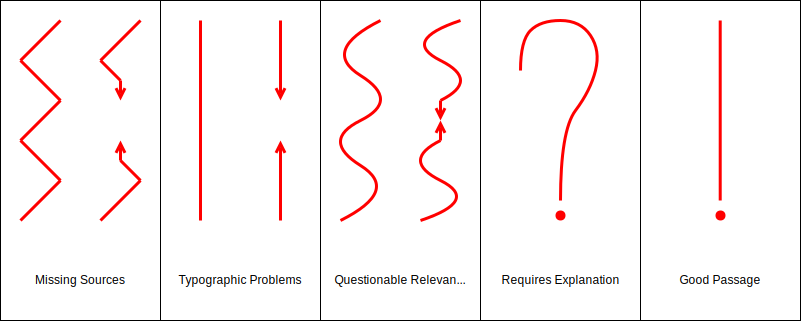

# Specification and Usage Guidelines of the MinCorMa Correction Marks

There are four different types of correction marks:
* General Marks
* Line Marks
* Float Marks
* Other Marks

## General Marks

General marks are the most versatile mark type because they can be used to annotate one or more consecutive lines of text at once, or even floating elements like figures. Therefore, they are designed such that their pattern can be repeated in accordance to the length of the passage to be annotated. However, annotating very long passages this way can become cumbersome. For such cases, some general marks feature an alternative notation that leverages arrows to indicate the beginning and the end of an annotation block. The alternative notation should only be used when necessary since excessive use can negatively affect the legibility of your correction marks.

General marks are always entered on the left side of the text. When multiple general marks span the same line(s) they are stacked sideways in arbitrary order.

## Line Marks

Many available guidelines suggest to annotate words right at their position in the text. Depending on the line spread of the text at hand, this becomes problematic very easily even for larger line spreads. Thus, the annotations of MinCorMa for words are still entered at the end of the lines, hence their name line marks. When it is unclear to which word a line mark refers to, they can be additionally highlighted using a text marker.

Line marks are always entered on the right side of the text. When multiple line marks refer to words in the same line they are stacked sideways where their order corresponds to the order of the annotated words.

## Float Marks

Float marks are a specific type of marks for annotating floating elements like figures, tables, listings and so on. Float marks are always entered on the right side of the floating element. When multiple float marks refer to words in the same floating element they are stacked sideways in arbitrary order.

## Other Marks

Other marks address miscellaneous aspects of marking and the marking process. So far there is only a single mark that falls under this category.

# Modifiers

To increase flexibility, the blank marks described above can be tweaked using a set of modifiers. The modifiers of correction marks are always entered on the right of the modified annotation in superscript. Similar to the alternative notation of the general marks, they should be used only when necessary since excessive use can negatively affect the legibility of your correction marks.

